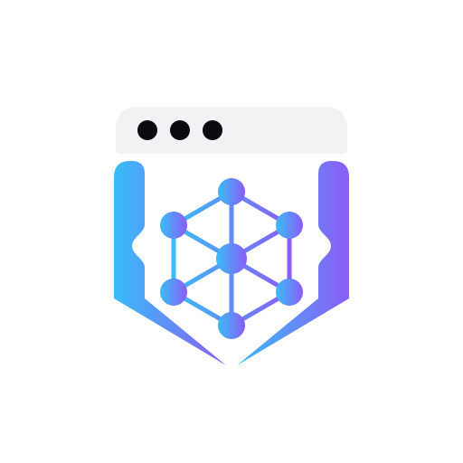
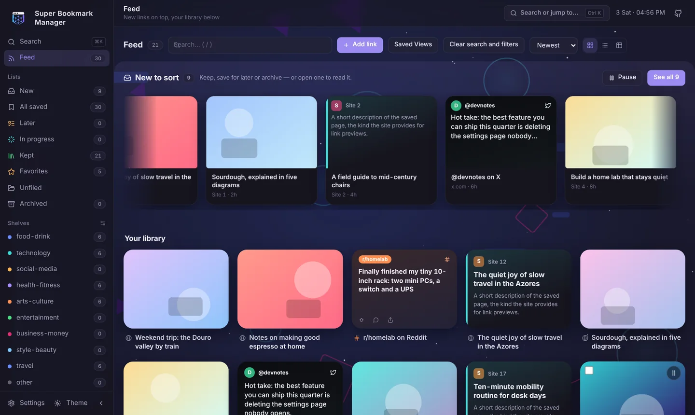
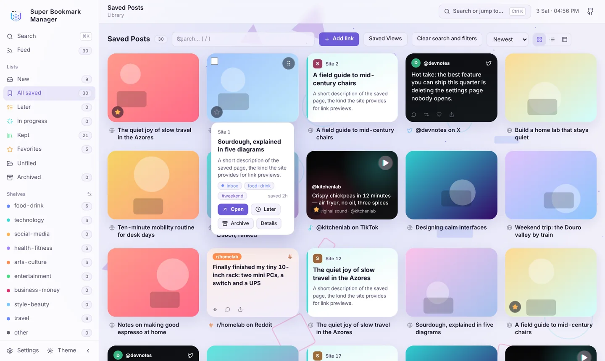

# Super Bookmark Manager



**A local-first feed for the links you save — browser bookmarks, Telegram Saved
Messages and WhatsApp chats — on Windows.**

[Website](https://browser-b0x.github.io/super-bookmark-manager/) ·
[Download](https://github.com/browser-b0X/super-bookmark-manager/releases/latest) ·
[Report a bug or suggest an idea](https://github.com/browser-b0X/super-bookmark-manager/issues)





<sub>Screenshots show sample links, not real user data.</sub>

## Features

- **One feed.** New, unsorted links drift across the top of the page; keep, save
  for later or archive each one in place. Everything you keep sits below as a
  picture-first library. When nothing new is waiting, older favourites resurface.
- **Bring your links.** Import browser bookmarks (Chrome, Edge, Brave, Firefox),
  Telegram Saved Messages and WhatsApp chat exports, or paste any link.
- **Good-looking cards without a thumbnail.** Posts from X, TikTok, Instagram,
  Facebook, Reddit and others are drawn in the spirit of their platform; plain web
  pages get a link-preview card with the site, title and description.
- **Organize your way.** Shelves, tags, notes, reading status, favourites, saved
  views, platform filters and search (`site:`, `#tag`, `is:later`). Drag tiles into
  your own order.
- **Optional AI tidying with free keys.** Add a Google Gemini, Groq, OpenRouter or
  NVIDIA NIM key — or point at a local Ollama server — and the app suggests shelves,
  tags, clean titles and one-line summaries for you to review. Without a key,
  local keyword rules sort your links.
- **Yours, on your PC.** Links live in a local SQLite library with export/restore
  backups. Light and dark themes.

## Installation

Download `SuperBookmarkManager-Setup.exe` and its checksum from the
[Releases page](https://github.com/browser-b0X/super-bookmark-manager/releases).
Run the installer for your Windows user, then launch **Super Bookmark Manager**
from the Start Menu (a Desktop shortcut is optional). Administrator rights, Python,
Node and npm are not required.

The app opens in your browser at `http://127.0.0.1:5001` and runs quietly in the
background. Launching it again reopens the running app. To stop it, use the power
button at the bottom of the sidebar (or **Settings → Quit Super Bookmark Manager**);
it saves any pending changes first. Installing or starting a newer version stops an
older copy that is still running, so you always get the version you installed.

The installer is **unsigned** and may trigger Windows SmartScreen or antivirus
warnings. Check its SHA-256 against the published checksum before running it.

### Upgrading from v0.1.0

v0.2.0 keeps its data in `%LOCALAPPDATA%\SuperBookmarkManager\`. Your v0.1.0 library in
`%LOCALAPPDATA%\SavedPostsDashboard\` is left untouched and is not imported
automatically. To bring it across, export a backup from v0.1.0's Settings before
upgrading, then restore that file in v0.2.0 under **Settings → Backup**.

### WinGet (pending availability)

A WinGet listing is prepared. It becomes available only after the release is
published and the WinGet community listing is accepted; until then this command
does not work:

```powershell
winget install --id browser-b0X.SuperBookmarkManager --exact --source winget --scope user
```

WinGet uses the same Windows installer. It does not remove security warnings or
add macOS/Linux support. [Package preparation details](packaging/winget/README.md).

## Bringing links in

All imports are in **Settings → Sources**. Drop a file and the format is detected;
you see a preview before anything is saved. Reimports merge links without replacing
your own edits.

- **Browsers:** an exported bookmark HTML file, a copied Chromium `Bookmarks` JSON
  file, or a copied Firefox `places.sqlite` file (copy it with the browser closed).
  The app reads only files you select; it never scans live browser profiles.
  You can leave folders out or file a folder onto a shelf.
- **WhatsApp:** on your phone, open a chat (for example *Message yourself*), choose
  **Export chat → Without media**, and import the `.txt` file or `.zip`. WhatsApp
  Desktop and Web cannot export chats.
- **Telegram:** connect your account (below) to refresh Saved Messages, or import a
  Telegram Desktop JSON export.

## Telegram setup

1. [Sign in to Telegram's developer portal](https://my.telegram.org/auth), choose **API development tools**, and create an application to obtain your API ID and API hash.
2. Open **Settings → Sources** and find the Telegram section.
3. Save your developer credentials.
4. Choose **Connect Telegram**.
5. Enter your phone number.
6. Enter the verification code Telegram sends you.
7. Enter your two-step verification password only if requested.
8. Use **Refresh Telegram Saved Messages** to import messages explicitly.

API ID/Hash identify your Telegram application; they do not log you in. The Connect
flow establishes your local account session. There are no shared project API
credentials. Refresh reads up to 200 recent messages (or a smaller configured limit).

## Optional AI

No AI account or key is needed. Without one, imports are sorted by built-in keyword
rules and the app never contacts an AI provider.

To get suggestions for shelves, tags, clean titles and one-line summaries, open
**Settings → AI & previews** and add a key for any of these (each offers a free tier):

| Provider | Where to get a key |
| --- | --- |
| Google Gemini | [Google AI Studio](https://aistudio.google.com/apikey) |
| Groq | [Groq console](https://console.groq.com/keys) |
| OpenRouter | [OpenRouter keys](https://openrouter.ai/keys) (uses free models by default) |
| NVIDIA NIM | [build.nvidia.com](https://build.nvidia.com/settings/api-keys) |
| Local | An OpenAI-compatible server on your PC, such as [Ollama](https://ollama.com) |

Use **Test** to check a key. Providers are tried in order, so if one is rate-limited
the next one answers. Suggestions are shown for review — nothing is saved until you
accept it, and your own edits are never overwritten. When AI is used, the title,
link and text of the links being tidied are sent to that provider.

## Local data and privacy

There is no central Super Bookmark Manager account. The installed app keeps its
SQLite library, thumbnail cache, settings, AI keys (`ai.json`) and Telegram session
in `%LOCALAPPDATA%\SuperBookmarkManager\`.

Windows user-local file permissions protect these files; this is **not an encrypted
credential vault**. Verification codes and 2FA passwords are not stored. Keys,
sessions and the thumbnail cache are excluded from the repository, installer
payloads and library backups. Anyone with access to your Windows account or its
files may still obtain sensitive information.

Backups are local library exports. Restore creates a separate database for an
explicit switch; it does not silently replace your active library. Saved views and
display preferences live in your browser profile and are not part of backups.

## Network activity

The app is local-first, **not offline-only**:

- New links may be enriched with previews, which contacts the saved sites (and
  permitted redirects/images). Opening a link visits its site.
- Telegram is contacted only when you connect, test, log out or refresh.
- AI providers are contacted only when you add a key and run Test or a tidy-up.

## Uninstall

Uninstall **Super Bookmark Manager** in Windows Settings → Apps. Program files and
shortcuts are removed; your data is kept. For complete removal, quit the app, keep
any backups you want, and delete `%LOCALAPPDATA%\SuperBookmarkManager\` (and
`%LOCALAPPDATA%\SavedPostsDashboard\` if you used v0.1.0).

## Building from source

See [BUILDING.md](BUILDING.md) for prerequisites, build commands and outputs.
Windows is the verified packaged-release platform.

## Security

See [SECURITY.md](SECURITY.md) before sharing logs, screenshots or bug reports.

## Feedback & Suggestions

Help make **browser-b0X** better.

- 🐛 **Found a bug?** Submit a structured [Bug Report](https://github.com/browser-b0x/super-bookmark-manager/issues/new/choose)
- 💡 **Have an idea or question?** Start a discussion in [GitHub Discussions](https://github.com/browser-b0x/super-bookmark-manager/discussions)
- 🤝 **Want to contribute?** Pull requests and improvements are always welcome.

## Support the project

<p align="center">
  <a href="https://ko-fi.com/browserb0x">
    
  </a>
  &nbsp;
  <a href="https://buymeacoffee.com/browserbox">
    
  </a>
</p>

> Every contribution is appreciated, but never expected.  
> Using the project, reporting bugs, and sharing it with others helps too.

## License

[MIT](LICENSE), copyright 2026 browser-b0X. Dependency licenses are listed separately
in [THIRD_PARTY_LICENSES.md](THIRD_PARTY_LICENSES.md).
